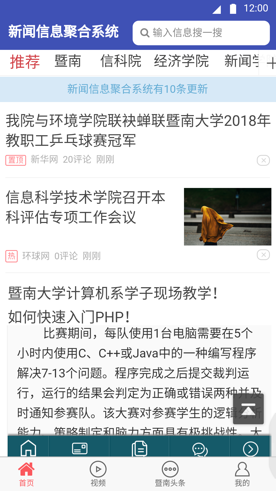
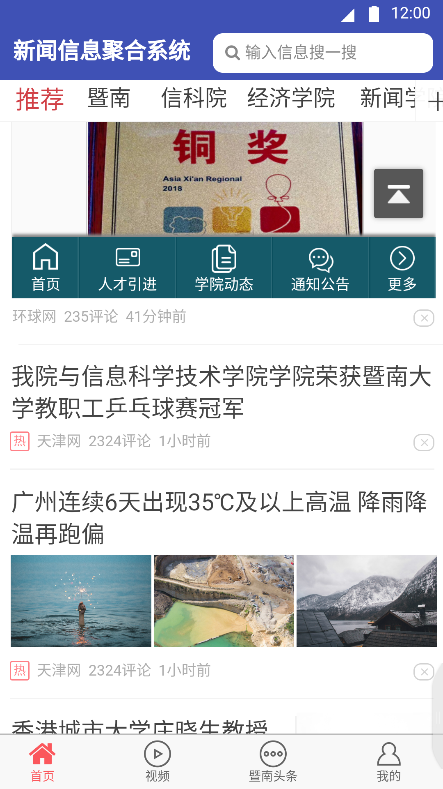
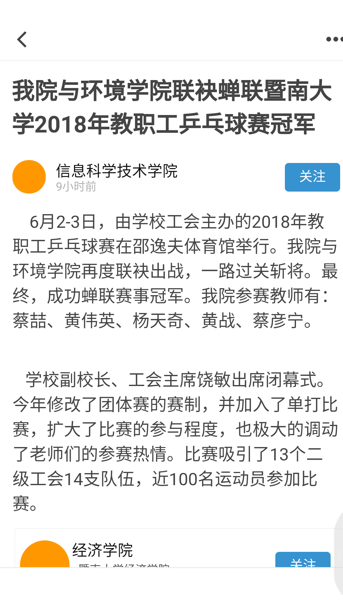
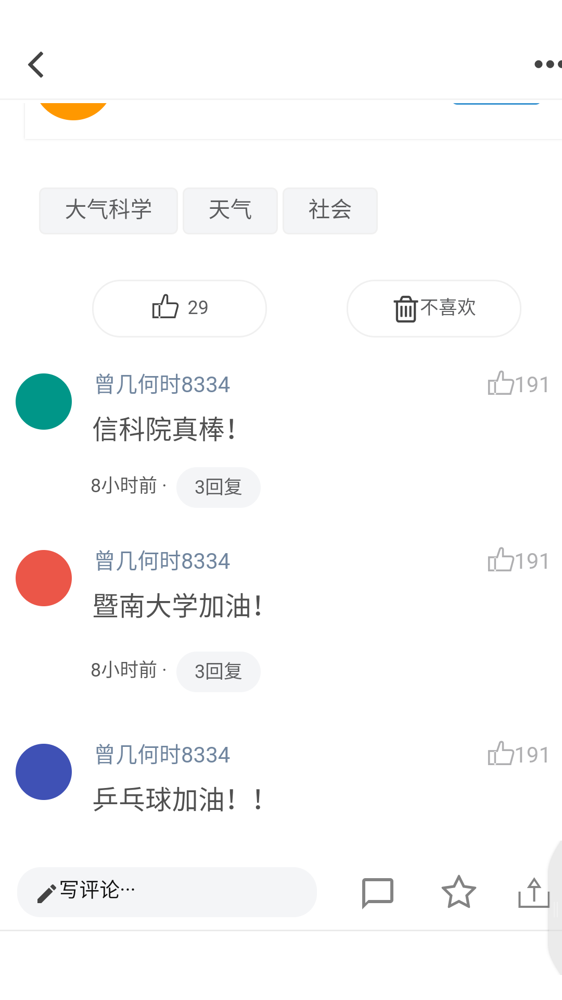
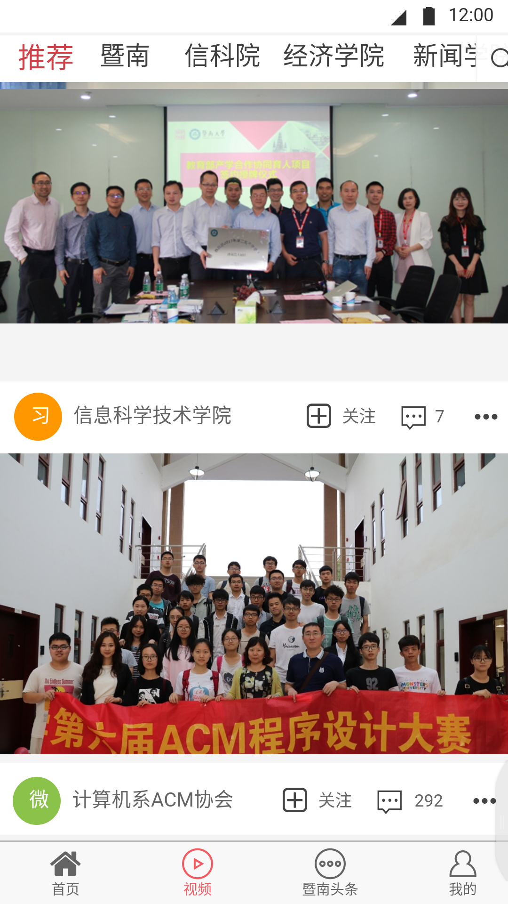
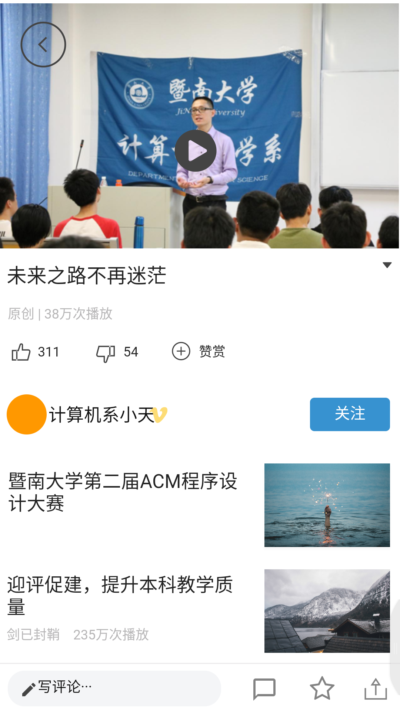
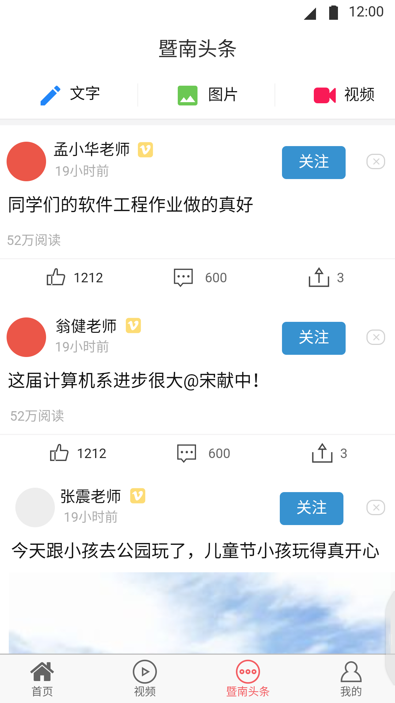
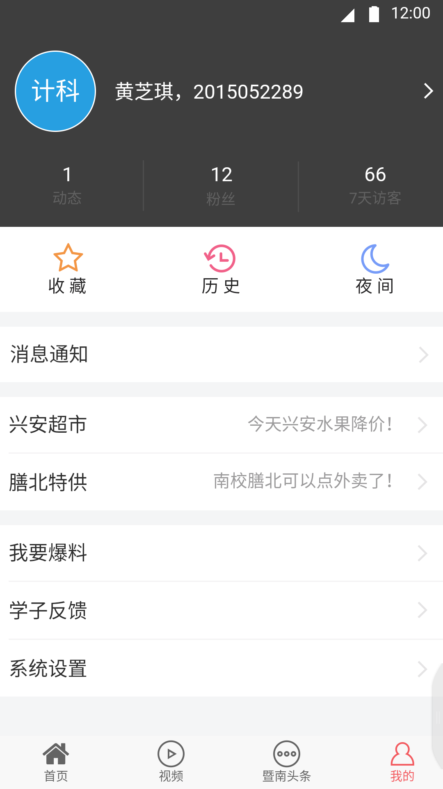
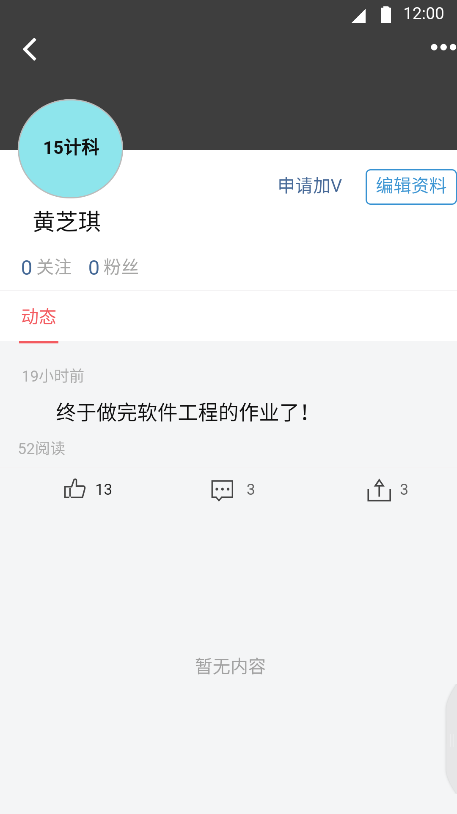

# 《暨南大学新闻信息聚合系统》

可以收集校内各个APP，并且为用户专属定制了发布动态、评论、转发功能；

由四个大模块组成：**首页**、**视频**、**暨南头条**、**我的**；（在底栏这四大模块间转换设计了“双击”，避免误触）

通过定期收集各个校内APP、web、公众号上的内容，向读者推荐校内热点新闻，并设计了校内视频、暨南头条、好友动态等模块。

## 图片展示

### 开启页面

### 首页

点击进入后:

### 视频

### 暨南头条

### 我的

